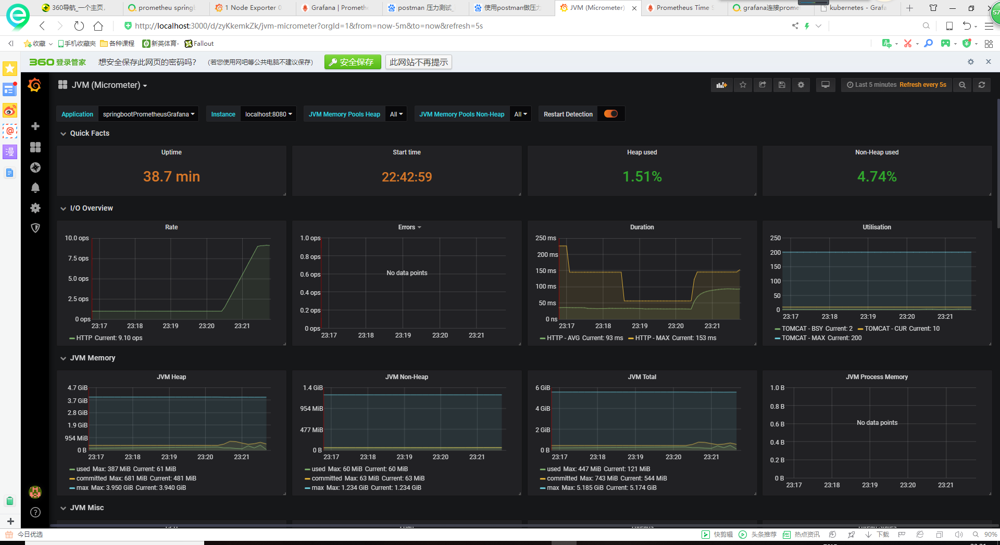
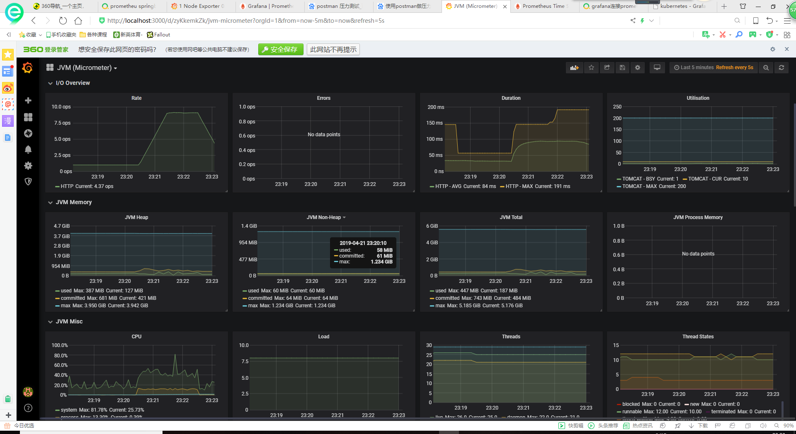

# Report on metrics of CPU and Memory utilization

---

---
## Testing method
To obtain the result, I used postman to run a test that sends 1000 post requests to application, 
the request being "localhost:8080/ladder" with body being "path:D:/SE/dictionary.txt;start:code;end:data"
,intervals between requests set to 1ms which didn't seem to have any effect on the speed at which the requests are being
sent, now that the period of time turn out to as long as a minute, far more than one second.

## Analysis on results
From the results we can see that as the rate of ops executed increases,the proportion of memory used did not change too noticably, 
but the rise in the usage of cpu is palpable.